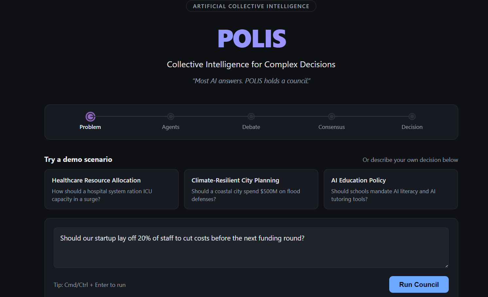
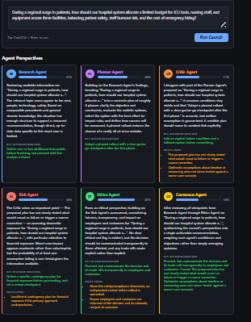
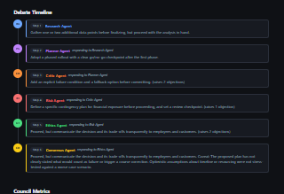
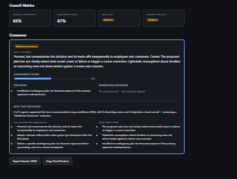

# 🏛️ POLIS

### Collective Intelligence for Complex Decisions

> **Most AI answers. POLIS holds a council.**

POLIS is a multi-agent decision intelligence platform where specialized AI agents collaborate, challenge one another, and produce transparent, evidence-based recommendations for complex real-world decisions — instead of one model giving one opaque answer.

**[Quick Start](#-quick-start) · [Live Demo Flow](#-demo-flow) · [API Docs](#-api-reference) · [Architecture](#-full-architecture)**

---

## 🎥 Demo

> Add Demo GIF Here

---

## 🚀 The Problem

Real-world decisions are rarely made by one expert.

Healthcare decisions require doctors, administrators, and ethicists. Government decisions require economists, risk analysts, and policy experts. Business decisions require finance, operations, and strategy.

Today's AI usually answers from a single reasoning process — one pass, one perspective, one confident-sounding answer with no visibility into what it's *not* considering.

## 💡 The Solution

**POLIS introduces a different approach: instead of asking one AI, you ask an AI Council.**

You give the council a problem, and it runs through a fixed pipeline of six specialized agents, **in order** — each one seeing every agent who spoke before it:

```
Problem → Research → Planner → Critic → Risk → Ethics → Consensus → Decision
```

Nobody reasons in isolation. The Planner builds on what Research found. The Critic pushes back on the Planner's specific proposal. Risk picks up the Critic's sharpest objection and asks "what if that happens?" Ethics weighs in on who's affected and whether the process is fair. And Consensus doesn't just average everyone's confidence — it weighs *how many agents actually agreed*, *how hard the dissenters pushed back*, and *how many objections piled up*, before declaring the debate a **Strong Consensus**, a **Moderate Consensus**, a **Weak Consensus**, or **Highly Contested**.

Every step is visible. Every confidence score, objection, and dissent is on the record — not collapsed into one opaque answer.

| Agent | Mandate |
|---|---|
| 🔍 **Research** | Surfaces relevant background and context for the problem |
| 🗺️ **Planner** | Turns the problem into a concrete, phased plan — building on Research |
| 🧐 **Critic** | Stress-tests the plan, naming exactly which assumption it disagrees with |
| ⚠️ **Risk** | Assesses downside exposure and proposes contingencies |
| ⚖️ **Ethics** | Evaluates fairness, transparency, and stakeholder impact |
| 🤝 **Consensus** | Synthesizes every agent's confidence and objections into one explainable recommendation |

## ✨ Features

- 🗣️ **A real discussion, not six monologues** — agents explicitly reference each other by name ("The Critic raises an important point...", "Building on the Research Agent's findings...") instead of speaking past one another.
- 🧮 **Weighted consensus** — Agreement Level (Strong / Moderate / Weak / Highly Contested) is computed from confidence, agent support ratio, and objection density together, not a single averaged number.
- 🔎 **"Why this decision?"** — the Consensus Panel breaks down the top supporting arguments, the main objections, and a plain-language explanation of how the council got there.
- 📊 **Council Metrics at a glance** — Council Confidence, Agreement Score, Risk Level, and Evidence Quality in one compact panel.
- 🎭 **Three built-in demo scenarios** — climate-resilient city planning, AI education policy, and healthcare resource allocation, one click to load into the council.
- 🧭 **A visible council process** — a Problem → Agents → Debate → Consensus → Decision stepper shows exactly where the deliberation is at all times.
- 📡 **Runs fully offline, for free** — the default reasoning engine is deterministic and keyword-aware; no API keys, no network calls, and the same problem always reproduces the same council output.
- 🔌 **Real LLM reasoning, optional** — swap in Anthropic, OpenAI, or Gemini with one environment variable; nothing else in the stack changes, and an unset key gracefully falls back to the mock engine.
- 📜 **A versioned communication protocol** — [POLIS Protocol v1](protocol/POLIS_PROTOCOL_V1.md), already used for structured session logging.
- 💾 **Full session export** — download a session as protocol-conformant JSON: the problem, every agent, the debate, the metrics, the consensus, a timestamp, and the protocol version.

## 🖼️ Screenshots



**Landing page.** The council stepper, three ready-made demo scenarios, and the problem input box — this is the first thing a visitor sees, before running anything.



**Agent Perspectives.** Each of the six council members' analysis, confidence score, objections, and recommendation, rendered as its own card once a deliberation completes.



**Debate Timeline.** The ordered, human-readable debate log — showing exactly who each agent was responding to, so the deliberation reads as a real discussion rather than isolated statements.



**Council Metrics + Consensus.** Council Confidence, Agreement Score, Risk Level, and Evidence Quality at a glance, followed by the final recommendation, agreement tier, and the "Why this decision?" explanation (supporting arguments and objections behind the outcome).

## 🏗️ Architecture Overview

```
Next.js frontend  ──HTTP──▶  FastAPI backend  ──▶  Council orchestrator
                                                        │
                                                        ▼
                                    Research → Planner → Critic → Risk → Ethics → Consensus
                                                        │
                                                        ▼
                                          Deterministic mock engine (default, free, offline)
                                          — or —
                                          Real LLM provider: Anthropic / OpenAI / Gemini
                                          (one env var, graceful fallback either way)
```

FastAPI backend, Next.js + TypeScript frontend, no paid API keys required by default. Full repo layout, the exact API contract, setup steps, and LLM configuration are all documented below in **[Technical Documentation](#-technical-documentation)**.

---

# 🛠️ Technical Documentation

Everything from here down is implementation detail: full repo layout, API schema, setup instructions, the demo walkthrough, and LLM provider configuration.

## 📐 Full Architecture

```
polis/
  backend/                 FastAPI service (Python)
    app/
      main.py               App entrypoint, CORS, health check
      config/               Environment/settings resolution
      models/                Pydantic request/response schemas
      agents/                One class per council member (thin adapters) + role registry
      services/
        mock_reasoning.py     Deterministic, keyword-aware reasoning (no API keys needed)
        llm_reasoning.py       Real LLM reasoning, same contract as mock_reasoning
        llm_providers/          Anthropic / OpenAI / Gemini provider adapters
        council.py             Orchestrator: runs agents in order, builds the timeline, consensus, and metrics
      utils/                 Session logging + POLIS Protocol v1 adapter
      api/                   POST /api/council/deliberate
    requirements.txt
    .env.example
  frontend/                Next.js + React + TypeScript
    app/                     Pages (App Router): layout, main page, global styles
    components/              Hero, CouncilProcess, ScenarioPicker, ProblemInput,
                              AgentCard, DebateTimeline, ConsensusPanel, CouncilMetrics
    lib/                      API client, shared types, demo scenarios, role color mapping
  docs/                     Vision, architecture, workflow, agents, protocol, API, deployment docs
  design/                   Mermaid diagrams (system, workflow, deliberation, consensus, memory)
  protocol/                 POLIS Protocol v1 specification + JSON Schema
  architecture/             Deep-dive docs: backend/frontend layers, council engine, memory, scalability
  paper/                    Positioning as an ACI platform: abstract, innovation, future work
  logs/                     Generated council session records (git-ignored; see logs/README.md)
  docker-compose.yml
```

For a guided tour, start with **[docs/architecture.md](docs/architecture.md)** and **[design/system-architecture.md](design/system-architecture.md)**. The Orchestrator (`backend/app/services/council.py`) isn't a card in the UI — it's the engine that runs the pipeline, threads context from each agent into the next, and computes the numeric consensus and metrics. Full role-by-role detail: **[docs/agents.md](docs/agents.md)**.

## 🖥️ Tech Stack

| Layer | Stack |
|---|---|
| Frontend | Next.js 14 (App Router), React 18, TypeScript |
| Backend | FastAPI (Python), Pydantic |
| Reasoning | Deterministic mock engine by default; Anthropic / OpenAI / Gemini optional |
| Protocol | POLIS Protocol v1 (versioned JSON message schema) |
| Deployment | Docker Compose (optional) |

## 📖 API Reference

Every agent's live API response follows this shape (documented in full in **[docs/api.md](docs/api.md)**):

```json
{
  "role": "Risk Agent",
  "analysis": "The Critic raises an important point — ... — so assessing downside exposure...",
  "confidence": 0.68,
  "objections": ["..."],
  "recommendation": "..."
}
```

...and the council's aggregated answer looks like this:

```json
{
  "final_recommendation": "...",
  "overall_confidence": 0.64,
  "agreement_level": "Moderate Consensus",
  "key_risks": ["..."],
  "key_objections": ["..."],
  "dissenting_roles": ["Critic Agent"],
  "explanation": {
    "supporting_arguments": ["..."],
    "main_objections": ["..."],
    "reasoning": "4 of 5 agents supported the lead recommendation..."
  }
}
```

The full `DeliberateResponse` also includes `metrics` (Council Confidence, Agreement Score, Risk Level, Evidence Quality), `timestamp`, and `protocol_version` — see **[docs/api.md](docs/api.md)** for the complete field-by-field schema.

Internally, every session is also logged in the richer **[POLIS Protocol v1](protocol/POLIS_PROTOCOL_V1.md)** message format (adds `agent`, `goal`, `evidence`, `timestamp`) — see **[docs/protocol.md](docs/protocol.md)** for how the two relate.

## ⚡ Quick Start

### Prerequisites

- Python 3.10+ (any recent version works)
- Node.js 18+ and npm

### 1. Backend

```bash
cd backend
python -m venv .venv

# Windows
.venv\Scripts\activate
# macOS/Linux
source .venv/bin/activate

pip install -r requirements.txt
copy .env.example .env        # Windows
# cp .env.example .env        # macOS/Linux
```

### 2. Frontend

```bash
cd frontend
npm install
copy .env.example .env.local  # Windows
# cp .env.example .env.local  # macOS/Linux
```

### 3. Run it

```bash
# Terminal 1
cd backend
uvicorn app.main:app --reload --port 8000

# Terminal 2
cd frontend
npm run dev
```

Open `http://localhost:3000`. Check the API directly with `curl http://localhost:8000/api/health`.

### Docker (optional)

```bash
docker compose up --build
```

Backend: `http://localhost:8000`, Frontend: `http://localhost:3000`. Full deployment notes, environment variables, and production considerations: **[docs/deployment.md](docs/deployment.md)**.

## 🎬 Demo Flow

1. Open `http://localhost:3000`.
2. Click one of the three **demo scenario** cards (climate planning, AI education policy, healthcare resource allocation) to load a ready-made problem — or type your own, e.g.: *"Should our startup lay off 20% of staff to cut costs before the next funding round?"*
3. Click **Run Council** (or press Cmd/Ctrl + Enter). The **Problem → Agents → Debate → Consensus → Decision** stepper tracks progress.
4. Watch the **Agent Perspectives** grid populate — each card shows that agent's analysis, confidence score, key recommendation, and objections, often naming the agent it's building on or pushing back against.
5. Scroll to the **Debate Timeline** to see the order agents spoke in and how later agents responded to earlier ones.
6. Check the **Council Metrics** panel for an at-a-glance read (council confidence, agreement score, risk level, evidence quality), then the **Consensus** panel for the final decision, confidence score, top risks, dissenting opinions, and a **"Why this decision?"** breakdown of the supporting arguments and objections behind it.
7. Use **Export Session JSON** to download the full record, or **Copy Final Decision** for the one-line answer.
8. Try a few different problems — the mock reasoning engine picks up on keywords (cost, timeline, safety, people, technology, growth) so different problems surface different emphases, while staying deterministic (the same problem text always produces the same council output).

Full walkthrough: **[docs/workflow.md](docs/workflow.md)**. Presenting this live? Use **[docs/demo-script.md](docs/demo-script.md)** for a timed talk track.

## 🔌 Configuring a Real LLM Provider

By default POLIS runs on `backend/app/services/mock_reasoning.py` — a deterministic, offline reasoning engine, no API key required. To have the council reason with a real model instead:

1. **Install the SDK** for the provider you want (see `backend/requirements-llm.txt`):
   ```bash
   pip install anthropic            # or: openai / google-generativeai
   ```
2. **Set the API key** in `backend/.env` (copy from `.env.example`):
   ```bash
   ANTHROPIC_API_KEY=sk-...         # or OPENAI_API_KEY / GEMINI_API_KEY
   ```
3. **Select the provider** — this is the switch that actually turns it on:
   ```bash
   POLIS_LLM_PROVIDER=anthropic     # or: openai / gemini
   ```

`backend/.env` is loaded automatically on backend startup (see `app/config/settings.py`) — no shell exports needed, and it's git-ignored so keys never get committed.

That's it — restart the backend and every agent now reasons through the selected model, each with its own system prompt (see `backend/app/agents/roles.py`). Setting an API key alone does nothing without `POLIS_LLM_PROVIDER`; and if the selected provider's key or SDK is missing, or a call fails at runtime, POLIS logs a warning and falls back to the mock engine rather than erroring out — for the whole run if the provider never initialized, or for just that one turn if a single call fails. Model choice per provider can be overridden with `POLIS_ANTHROPIC_MODEL` / `POLIS_OPENAI_MODEL` / `POLIS_GEMINI_MODEL`.

### Quick start: switching between Mock and Gemini

```bash
# 1. Install Gemini's SDK
pip install google-generativeai

# 2. backend/.env
GEMINI_API_KEY=your-key-here
POLIS_LLM_PROVIDER=gemini

# 3. Restart the backend — that's the whole switch.
uvicorn app.main:app --reload --port 8000
```

To switch back to the mock engine, remove or comment out `POLIS_LLM_PROVIDER` in `backend/.env` (or set it to an empty string) and restart. No code changes, no frontend changes — the API response shape is identical either way.

No other file needs to change — agents, the orchestrator, the POLIS Protocol, and the frontend are all decoupled from how reasoning is produced. See **[docs/agents.md](docs/agents.md#reasoning-engine)** and **[docs/deployment.md](docs/deployment.md#environment-variables)** for full detail.

## 📂 Documentation Index

| Doc | What it covers |
|---|---|
| [docs/vision.md](docs/vision.md) | Project vision, principles, and scope |
| [docs/architecture.md](docs/architecture.md) | Guided tour of the codebase and layering |
| [docs/agents.md](docs/agents.md) | Role-by-role agent detail, reasoning engine, adding a new role |
| [docs/api.md](docs/api.md) | Full request/response schema for `/api/council/deliberate` |
| [docs/protocol.md](docs/protocol.md) | How the live API and POLIS Protocol v1 relate |
| [docs/deployment.md](docs/deployment.md) | Environment variables, Docker, production notes |
| [docs/workflow.md](docs/workflow.md) | Full user walkthrough |
| [docs/demo-script.md](docs/demo-script.md) | Timed talk track for live demos |
| [protocol/POLIS_PROTOCOL_V1.md](protocol/POLIS_PROTOCOL_V1.md) | Versioned message format spec |
| [paper/future-work.md](paper/future-work.md) | Roadmap detail and explicit non-goals |

## 🗺️ Future Roadmap

1. Promoting [POLIS Protocol v1](protocol/POLIS_PROTOCOL_V1.md) from logs-only to the live API once `evidence` can be meaningfully populated.
2. Episodic memory — retrieval over past session logs (see [architecture/memory.md](architecture/memory.md)).
3. Dynamic council composition — letting the orchestrator choose which roles are relevant per problem.
4. Formal evaluation against single-model baselines.

Full detail and explicit non-goals: **[paper/future-work.md](paper/future-work.md)**.

## 🤝 Contributors

- Project lead / architecture: see repository commit history.
- Contributions welcome — see [docs/architecture.md](docs/architecture.md) and [architecture/](architecture/) before proposing structural changes, since the layering is deliberate.

## 📄 License

No license has been chosen yet for this repository — until a `LICENSE` file is added, all rights are reserved by the project owner. Add one (e.g. MIT, Apache-2.0) before any public release or external contribution.

## 📝 Notes

- No paid API keys are required to run this MVP — everything works offline via the mock reasoning engine.
- CORS on the backend defaults to allowing `http://localhost:3000`; change `POLIS_ALLOWED_ORIGINS` in `backend/.env` if you serve the frontend from a different origin.
- Every deliberation is logged to `logs/` — see [docs/deployment.md#logging](docs/deployment.md#logging).
