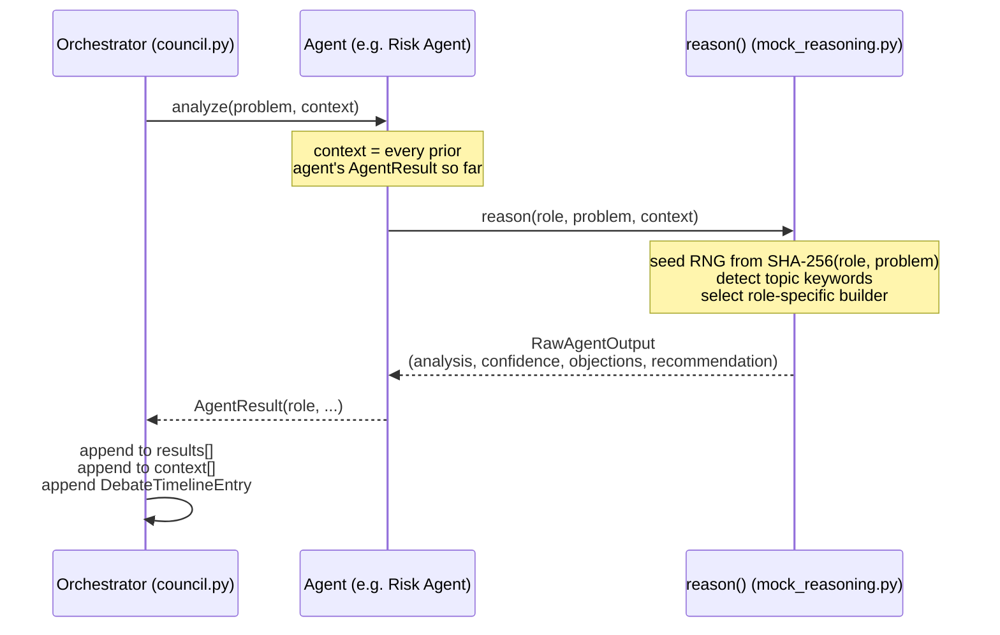

# Diagram: Agent Workflow

How a single agent's turn works inside the pipeline. See
[docs/agents.md](../docs/agents.md).

## Notes

- `context` grows by one entry per turn, so the sixth participant
  (Critic) has visibility into five prior results; the first
  participant (Research) has none.
- `reason()` is a pure function: same `(role, problem, context)` in,
  same `RawAgentOutput` out. That determinism is what makes council
  output reproducible across runs — see
  [docs/workflow.md](../docs/workflow.md).
- Replacing `R` with an LLM-backed implementation changes nothing about
  this sequence — the contract (`RawAgentOutput` in, `AgentResult` out)
  stays identical.
