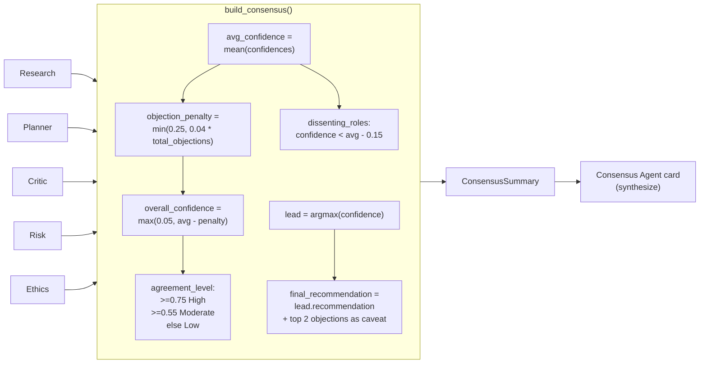

# Diagram: Consensus Flow

How five independent `AgentResult`s become one `ConsensusSummary`. See
`build_consensus()` in `backend/app/services/council.py` and
[docs/workflow.md](../docs/workflow.md).

## Notes

- Consensus is **arithmetic, not another LLM call**: it is fully
  deterministic given the five upstream `AgentResult`s, which keeps the
  final answer auditable — you can recompute it by hand from the
  numbers shown on each agent's card.
- `key_risks` is intentionally sourced only from the Risk Agent's
  objections; `key_objections` pools every agent's objections. Both are
  surfaced in the UI's Consensus panel, not just used internally.
- Because the Consensus Agent's card is built from the same
  orchestrator-computed values as the `ConsensusSummary` panel, the two
  can never disagree with each other in the UI.
