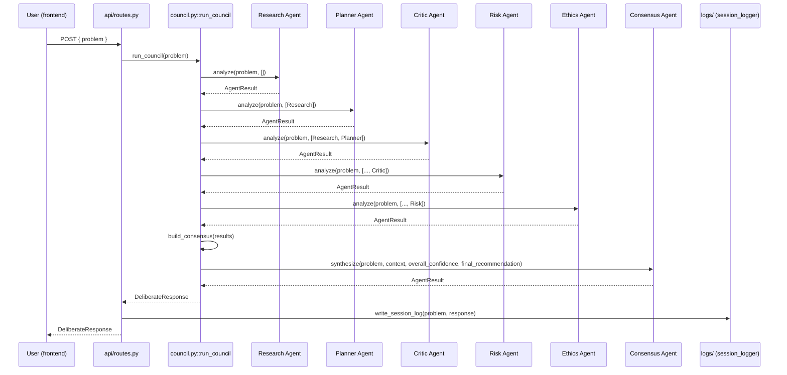

# Diagram: Council Deliberation

The full fixed pipeline for one `POST /api/council/deliberate` call. See
[docs/workflow.md](../docs/workflow.md).

## Notes

- The pipeline is strictly sequential and fixed-order today (no
  parallel agents, no re-entrant rounds). This is a deliberate MVP
  simplification — see [architecture/scalability.md](../architecture/scalability.md)
  for what a multi-round or parallel debate model would require.
- Session logging happens after the response is assembled but is not on
  the critical path for the client — a logging failure is caught and
  does not turn a successful deliberation into a failed request.
