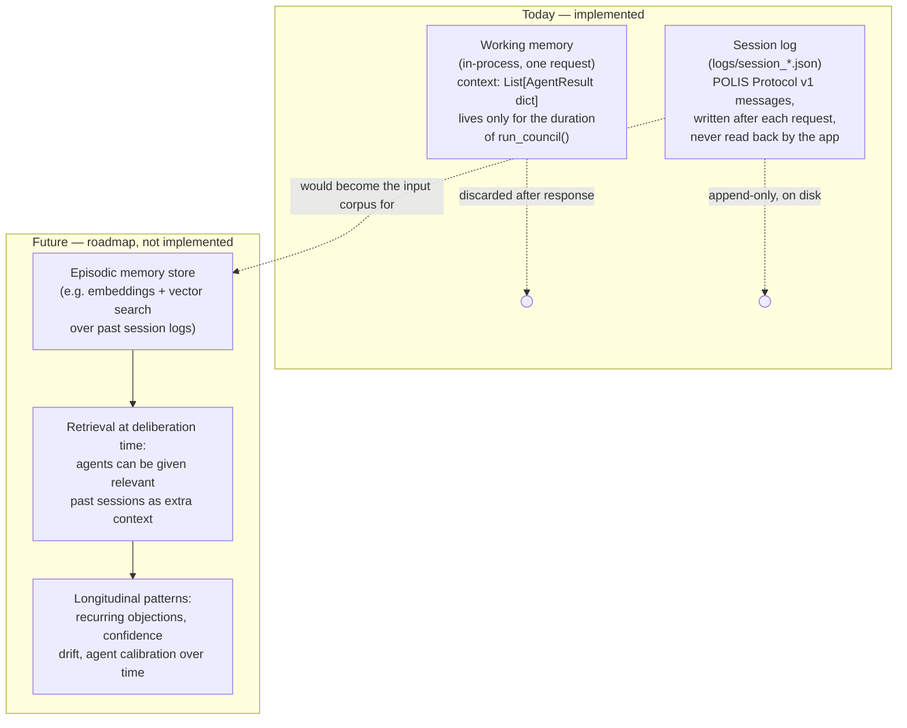

# Diagram: Memory Flow

POLIS today has **no cross-session memory** — every deliberation is
stateless. This diagram shows what actually persists today (working
context + session logs) versus what's planned. See
[architecture/memory.md](../architecture/memory.md) for the full
discussion and [paper/future-work.md](../paper/future-work.md) for the
roadmap.

## Notes

- The only thing that persists between two different problems today is
  the **code** (agent order, reasoning templates) — never the content of
  a prior deliberation.
- The session log (`logs/`) is written for **audit and observability**,
  not consumed by the app itself. It is the natural raw material for a
  future memory store, which is why it's already structured as
  [POLIS Protocol v1](../protocol/POLIS_PROTOCOL_V1.md) messages rather
  than an ad hoc dump.
- Do not read "Future" as implemented — it is intentionally drawn as a
  separate, dashed-line subgraph to avoid overstating current
  capability. See [paper/abstract.md](../paper/abstract.md) for the
  same scoping in prose.
