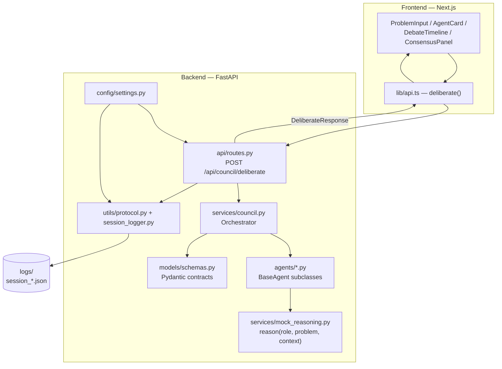

# Diagram: System Architecture

Layer-by-layer view of how a request moves through POLIS today. See
[docs/architecture.md](../docs/architecture.md) for the prose version.

## Notes

- The frontend never talks to `services/` or `agents/` directly — the
  API layer is the only seam it depends on, and that seam's shape is
  fixed by `models/schemas.py`.
- `utils/` sits beside, not inside, the request/response path: it
  converts the same `DeliberateResponse` into a logged record without
  altering what's sent back to the client.
- Swapping `mock_reasoning.py` for a real LLM module changes exactly one
  box in this diagram (`Reasoning`) — everything above and beside it is
  unaffected. See [docs/agents.md](../docs/agents.md#reasoning-engine).
